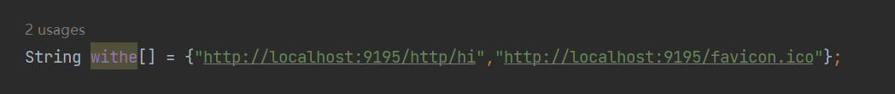

# shenyu-sso

### Step1.Deploy Casdoor

#### Step1.1 Firstly, the Casdoor should be deployed. 

You can refer to the Casdoor official documentation for the [Server Installation](/docs/basic/server-installation).

After a successful deployment, you need to ensure:

- The Casdoor server is successfully running on **http://localhost:8000**.
- Open your favorite browser and visit **http://localhost:7001**, you will see the login page of Casdoor.
- Input `admin` and `123` to test login functionality is working fine.

Then you can quickly implement a casdoor based login page in your own app with the following steps.

#### Step1.2 Configure application.properties

you need change the parameter to your casdoor parameter in shenyu-plugin-auth/application.properties.

### Stpe2.Add this plugin to ShenYu.

1. Move shenyu-plugin-auth to shenyu-plugin.
2. Move shenyu-spring-boot-starter-plugin-auth to shenyu-spring-boot-starter/shenyu-spring-boot-starter-plugin
3. Add dependency in shenyu-bootstrap/pom.xml

### Step3.Withelist Configure

You can add the witheList in shenyu-plugin-auth/org/apache/shenyu/plugin/auth/AuthPlugin

